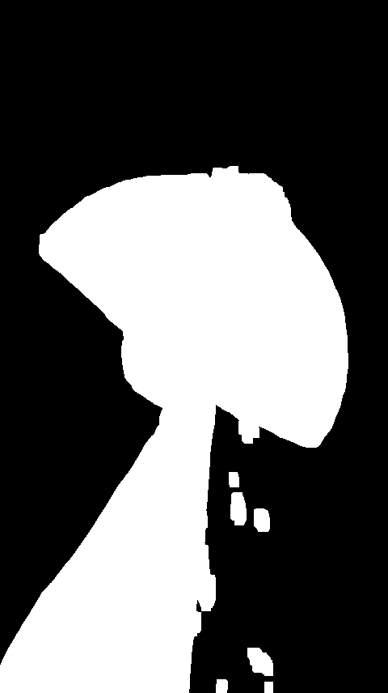
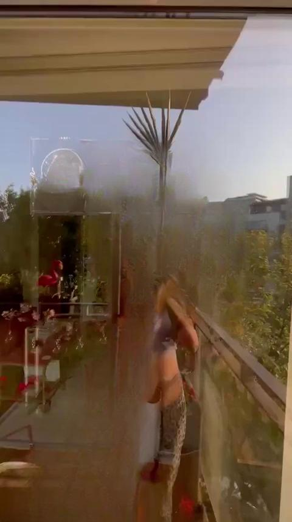
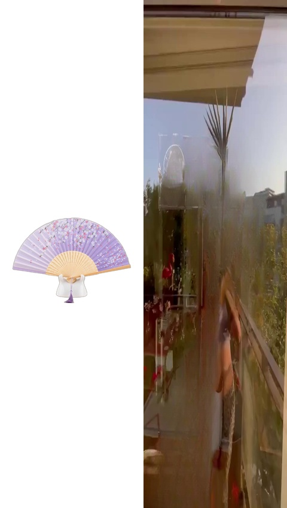
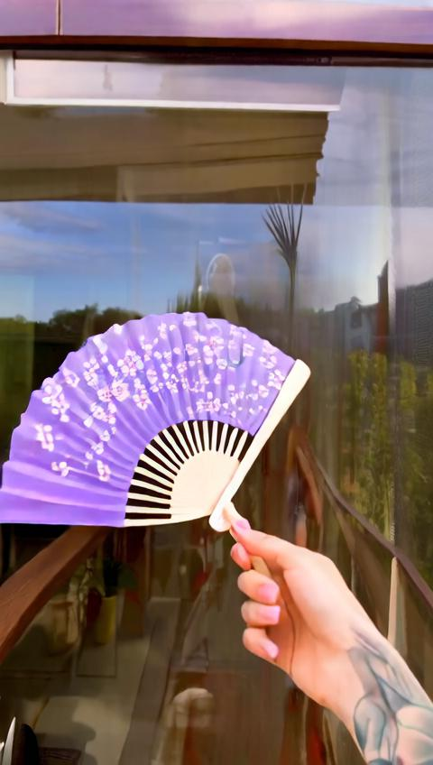

# 周报 | Weekly Report

---

## 基本信息

- **姓名：** 钟蕊
- **日期：** 2026-03-30

---

## 1. 研究领域

产品视频模板迁移（Product Video Template Transfer, PVTT）：给定一段产品宣传视频（源视频 + 源产品）和一张目标产品图片，生成外观为目标产品、运动/场景与源视频一致的新产品视频。当前基于 VACE 视频生成模型 + FFGo 首帧参考方案进行零样本推理复现与优化探索。

## 2. 领域核心问题

**核心问题：** 如何在零样本/少样本条件下，将产品外观迁移到视频中，同时保持产品身份一致性、场景自然性和时序连贯性。

当前面临的具体挑战：

1. **首帧物体去除质量不足**：当前使用 rembg + LaMa 进行源视频首帧的产品擦除，存在 mask 范围过大（将手、支架等非产品区域也一并擦除）和擦除后修复痕迹明显的问题，导致右半拼贴画面的背景质量影响下游生成
2. **产品身份保持依赖隐式参考**：FFGo 方案中模型仅通过首帧拼贴隐式参考产品外观，随帧数增加参考强度衰减，细节丰富的产品（如复杂纹理、logo）容易在生成过程中丢失
3. **首帧拼贴分辨率匹配**：拼贴首帧的分辨率必须与源视频一致（如竖屏视频 480x856），否则会导致转场不自然和画面变形

## 3. 技术方案

### 当前方案（本周实现）：FFGo + VACE 1.3B 零样本推理

基于 FFGo 首帧参考范式，利用 VACE 1.3B 模型的首帧保留能力实现零微调产品视频迁移：

```
产品 RGBA 图（白底居中）  ─┐
                          ├─→ FFGo 拼贴首帧（左=产品白底，右=擦除产品后的背景）
源视频首帧（LaMa 擦除）  ─┘
    ↓
VACE 1.3B 推理（首帧 mask=0 保留，后续帧 mask=1 生成）
    ↓
SSIM 转场检测 → 裁剪转场帧 → 最终视频
```

### 后续优化方向

- **方向一（工程优化）**：替换 LaMa 为更强的 inpainting 模型（如 FLUX Fill / PowerPaint-V2），改善首帧背景擦除质量
- **方向二（论文贡献）**：双条件 CFG 训练——训练时同时使用"完美擦除首帧"和"未擦除原始首帧"作为条件，使模型对不完美输入具有鲁棒性，推理时可直接使用原始首帧而无需 inpainting
- **方向三（论文贡献）**：产品身份持续注入——利用冻结 DINO-v2 编码器提取产品特征，通过 cross-attention 在每步 denoising 中持续注入，解决首帧参考随帧数衰减的问题

## 4. 本周工作

- [x] **搭建 FFGo + VACE 1.3B 端到端推理流水线**：实现 4 个脚本（generate_rgba.py / ffgo_prepare_frame.py / ffgo_vace_infer.py / ffgo_batch_infer.py），在服务器上跑通完整流程
- [x] **生成 35 张 RGBA 产品图**：使用 rembg 对 PVTT 数据集全部 35 张产品图完成背景去除
- [x] **解决 LaMa 模型部署问题**：服务器无法访问 HuggingFace，通过代理下载 big-lama.pt（197MB torchscript）并手动部署到 ~/.cache/torch/hub/checkpoints/，SimpleLama 加载成功
- [x] **迭代优化首帧拼贴（3个版本）**：
  - v1：右半黑色填充 + 固定 832x480 → 转场在第 11 帧，过长且不自然
  - v2：右半白色填充 + LaMa inpainting → 转场缩短到第 4 帧
  - v3：拼贴分辨率匹配源视频（480x848 竖屏）+ meta.json 动态传参 → 转场仅 3 帧，画面比例与源视频一致
- [x] **VACE 1.3B 推理验证**（任务 0001-handfan1_to_handfan2）：
  - 生成 81 帧 @ 480x848，50 步去噪，约 4 分钟/任务（RTX 5090 单卡）
  - SSIM 转场检测正常工作，裁剪后 78 帧有效视频
  - 产品外观基本可识别，转场过渡自然

## 5. 结论与发现

### 关键结论

1. **FFGo + VACE 1.3B 零样本推理可行**：无需 LoRA 微调，仅通过首帧拼贴 + 转场提示词（"The camera view suddenly changes."），VACE 1.3B 即可生成合理的产品视频，验证了 FFGo 范式的有效性
2. **拼贴首帧分辨率必须匹配源视频**：v1/v2 使用固定 832x480 横屏分辨率处理 480x856 竖屏视频，导致画面比例失配和转场不自然；v3 改为动态读取源视频分辨率后，转场从 11 帧缩短到 3 帧
3. **当前瓶颈在 mask 擦除环节**：rembg 的前景分割不够精确（如 handfan 任务中将手持手扇的手也一并 mask 掉），且 LaMa 的修复质量有限（残留模糊痕迹），这些瑕疵会被 VACE 模型当作场景内容保留到生成视频中

### 实验数据对比

| 版本 | 拼贴分辨率 | 右半背景 | Inpainting | 转场帧数 | 有效帧数 |
|:---:|:---:|:---:|:---:|:---:|:---:|
| v1 | 832x480（固定横屏） | 黑色填充 | cv2.INPAINT_TELEA | 11 | 70 |
| v2 | 832x480（固定横屏） | 白色填充 | SimpleLama | 4 | 77 |
| **v3** | **480x848（匹配源视频）** | **白色填充** | **SimpleLama** | **3** | **78** |

### 可视化结果（任务 0001-handfan1_to_handfan2）

<table>
  <tr>
    <th>Step 1: 产品 Mask（rembg）</th>
    <th>Step 2: LaMa 擦除背景</th>
    <th>Step 3: FFGo 拼贴首帧</th>
    <th>Step 4: 转场结束帧（frame 3）</th>
  </tr>
  <tr>
    <td></td>
    <td></td>
    <td></td>
    <td></td>
  </tr>
  <tr>
    <td>rembg 将手臂也一并 mask，范围过大（当前瓶颈）</td>
    <td>擦除区域有模糊修复痕迹，整体背景结构保持</td>
    <td>左=目标产品白底居中，右=擦除后背景（480x848 竖屏）</td>
    <td>转场仅 3 帧，目标产品自然出现，外观与参考图一致</td>
  </tr>
</table>

## 6. 下周计划

- [ ] **改进物体检测与擦除**：将 rembg 通用前景分割替换为 Grounding DINO + SAM 的文本引导分割方案，利用 eval JSON 中的 `source_object` 字段（如 "hand fan"）精确定位产品区域，避免将手、支架等非产品部分错误 mask
- [ ] **评估更强的 Inpainting 模型**：在服务器部署 PowerPaint-V2 或 BrushNet 替换 LaMa，对比擦除质量（残留伪影、背景连续性）
- [ ] **批量推理与定量评估**：在 PVTT 数据集上批量运行 FFGo 推理（199 个任务），计算 MFS（帧间一致性）、ProdCLIP（产品匹配度）等指标，建立 baseline 数据
- [ ] **开始方向二预研**：调研 FLUX Fill 在服务器部署的可行性（模型约 12B，显存需求），为双条件 CFG 训练准备"完美擦除"版本的首帧数据

---

## 附录

### 服务器环境

| 配置 | 详情 |
|------|------|
| GPU | 8×RTX 5090 (32GB) |
| Conda 环境 | diffs (Python 3.10, DiffSynth 2.0.4) |
| 模型 | VACE-1.3B (DiT 1419M + VACE 735M), T5-XXL, VAE |
| Workspace | /data/zhongrui/PVTT_Workspace/ip_adapter |

### 脚本文件

| 脚本 | 功能 |
|------|------|
| scripts/generate_rgba.py | rembg 批量背景去除 → RGBA 产品图 |
| scripts/ffgo_prepare_frame.py | FFGo 首帧构造（mask 检测 + LaMa 擦除 + 拼贴） |
| scripts/ffgo_vace_infer.py | VACE 1.3B 单任务推理 + SSIM 转场检测 |
| scripts/ffgo_batch_infer.py | 批量推理封装（自动 RGBA + 首帧 + 推理 + 裁剪） |

### 参考论文

- FFGo (2025.11): [arXiv:2511.15700](https://arxiv.org/abs/2511.15700)
- VACE (ICCV 2025): [arXiv:2503.07598](https://arxiv.org/abs/2503.07598)
- PowerPaint-V2 (ECCV 2024): https://powerpaint.github.io/
- BrushNet (ECCV 2024): [arXiv:2403.06976](https://arxiv.org/abs/2403.06976)
- Unconditional Priors Matter! (2025.3): [arXiv:2503.20240](https://arxiv.org/abs/2503.20240)
- ConsisID (CVPR 2025): [arXiv:2411.17440](https://arxiv.org/abs/2411.17440)
